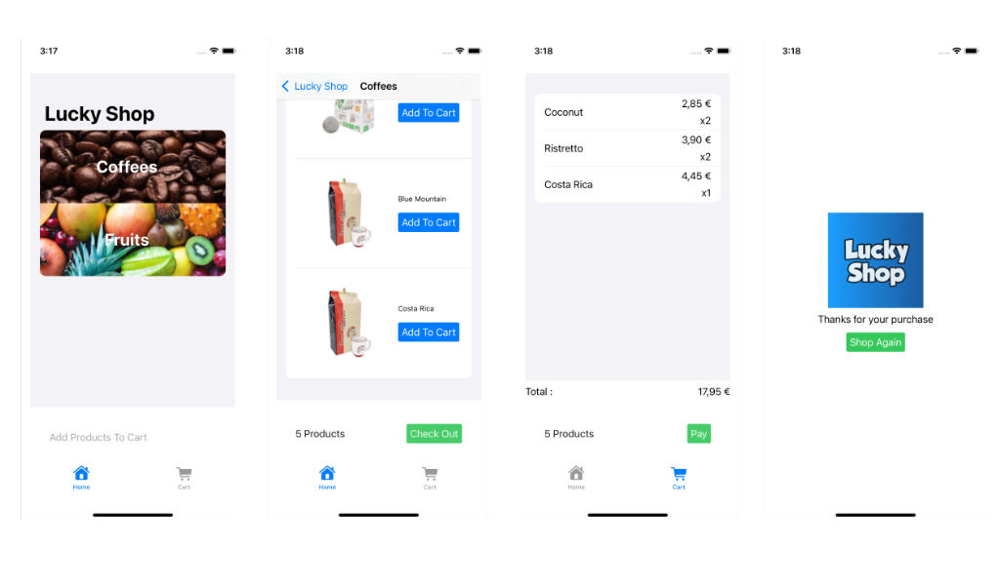

# <font color='#10409F'>Lucky Shop</font>

<b>Lucky Cart Client Sample Application Project</b>

A simple shopping application sample using a trivial structure ( Shop, Customer, Cart, Products and Orders ).

It demonstrates the LuckyCart integration steps that will enable promotional banners and games.

This is a SwiftUI based project, that runs on ios and macos platforms.



## <font color='#1E72AD'>Installation:</font>

### Swift Package:

 Add the <b>LuckyCart</b> Package using xCode

### CocoaPods:

 ```
 pod 'LuckyCart'
 ``` 
 
## <font color='#1E72AD'>Use in Client Application:</font>


### 1 - Conform to the `LuckyCartClient` protocol

You can make the application your main shop manager class conform to this protocol.
You can also create a new 'LuckyCartManager'.

This protocol is required at some place in your code to :

- Initialize LuckyCart with your credentials
- Generate the data required by the LuckyCart platform
- Proceed the check out
 
```swift
public protocol LuckyCartClient {
    
    /// Starts the LuckyCart framework
    func initLuckyCart()

    /// Send the ticket to LuckyCart
    func checkOut(failure: @escaping (Error)->Void,
                  success: @escaping (LCPostCartResponse)->Void)
    
    /// Returns the client meta data
    var metaDataForLuckyCart: LCTicketComposer.MetaData { get }
    
    /// Returns the client customer data mapped to LuckyCart format
    var customerForLuckyCart: LCTicketComposer.Customer { get }
    
    /// Returns the client cart data mapped to LuckyCart format
    var cartForLuckyCart: LCTicketComposer.Cart { get }
    
    /// Returns the client order data mapped to LuckyCart format
    var orderForLuckyCart: LCTicketComposer.Order { get }
}
```


### 1 - Start LuckyCart 

Once you have choosen the object you want to interact with LuckyCart, implement the protocol methods.

#### Initialize

Starts the LuckyCart framework using authorization, luckyCart customer and cart ids. 

```swift
class MyShopManager: LuckyCartClient {

    func initLuckyCart() {
        let auth = LCAuthorization(key: <authKey>, secret: <secret>)
        let luckyCartCustomer = LCCustomer(<id>)
        let luckyCartCart = LCCart(<id>)

        _ = LuckyCart(authorization: LuckyCart.testAuthorization,
                      customer: LuckyCart.testCustomer,
                      cart: LuckyCart.testCart)
    }
}
```

#### Fill the ticket information

Each time your application does a check out, relevant informations are sent to LuckyCart.
To avoid sending wrong information, the LuckyCart framework propose a Ticket composer object.

This composer request some sub-composers for the Customer, the Cart, The Product orders and the Order.

- return customer information (`LCTicketComposer.Customer`)
    - customerClientID : The id of the customer in your system
    - firstname, lastname, email : The basic information about the customer

- return cart information (`LCTicketComposer.Cart`)
    - cartClientId : The id of the cart in the client system
    - currency : The currency used in this cart
    - ttc, ht : The product final price, and price without taxes
    - products : The list of products

- return order information (`LCTicketComposer.Order`)
    - shippingMethod: The way the order will be delivered to customer.
    - shopId: The id of the shop in your system
    - device: The device information string 

- return product orders information (`LCTicketComposer.ProductOrder`)
    - id: The id of the order in your system
    - quantity: The number of articles
    - ttc, ht: The product unit final price, and price without taxes 
    
- return custom information (`LCTicketComposer.MetaData`)
    - dictionary: A free json convertible dictionary

Example of implementation:

```swift
extension MyShopManager {
    
    var metaDataForLuckyCart: LCTicketComposer.MetaData {
        LCTicketComposer.MetaData(dictionary: [
            "luckyCoupon" : luckyCoupon
        ])
    }
    
    var customerForLuckyCart: LCTicketComposer.Customer {
        LCTicketComposer.Customer(customerClientId: customer.id.uuidString,
                                  email: customer.eMail,
                                  firstName: customer.firstName,
                                  lastName: customer.lastName)
    }
    
    var cartForLuckyCart: LCTicketComposer.Cart {
        LCTicketComposer.Cart(cartClientId: cart.id.uuidString,
                              currency: currency,
                              ttc: LCTicketComposer.priceString(cart.totalPrice),
                              ht: LCTicketComposer.priceString(cart.totalPriceWithoutTax),
                              products: productOrdersForLuckyCart)
    }
    
    var orderForLuckyCart: LCTicketComposer.Order {
        LCTicketComposer.Order(shippingMethod: .pickUp, shopId: shopId, device: "ios-sim")
    }
    
    var productOrdersForLuckyCart: [LCTicketComposer.ProductOrder] {
        cart.productOrders.map { order in
            LCTicketComposer.ProductOrder(id: order.id.uuidString,
                                          quantity: "\(order.quantity)",
                                          ttc: LCTicketComposer.priceString(order.totalPrice),
                                          ht: LCTicketComposer.priceString(order.totalPriceWithoutTax))
        }
    }
}
```

### 2 - Display Banners

#### SwiftUI

Make the views that should display <b>LuckyCart</b> banners conform to the `BannerSpaceView`.

You must then :

- Declare the following properties:
    - bannerSpaceId: The bannerSpace identifier associated to this view
    - banners: A state variable that will trigger a view update when changed
- Execute the LuckyCart loading function 
    - Call the `loadAllBanners` function in the view `.task` handler
    - Deal with the received banners and/or errors
    
In this example, the homepage view displays a logo and welcome message.
It then displays all available banners in a list.

How banners are used and displayed is the client responsaibility. 

```swift
struct MyHomePageView: BannerSpaceView {
    var bannerSpaceId: String = .homePage    
    @State var banners: [LCBanner] = []
    
    var body: some View {
        HStack {
            VStack(alignment: .center, spacing: 16) {
                Image("logo").resizable().frame(width: 160, height: 160, alignment: .center)
                Text("Welcome")
                
                // Displays the LuckyCart banners
                // --->
                
                List(banners) { banner in
                    LCBannerView(banner: banner)
                    .frame(height: 80, alignment: .center)
                }
                
                // <---
            }
        }.task {
            LuckyCart.shared.banner(with: .homepage, failure: { error in
                print("\(error.localizedDescription)")
            }) { banner in
                banners.append(banner)
            }
        }
    }
}
```

### 3 - Proceed Check Out

#### Implement the checkout

Once your application did a succesful checkout, call this function to send ticket information to LuckyCart and receive an aknowledgment.

```swift
extension MyShopManager {
    
    /// Send a request to check out and wait for the result
    func checkOut(failure: @escaping (Error)->Void,
                  success: @escaping (LCPostCartResponse)->Void) {
        
        // Sample shop does not send any request, it simply marks the cart as paid
        LuckyCart.shared.checkOut(ticketComposer: ticketComposerForLuckyCart,
                                  failure: { error in
            DispatchQueue.main.async { 
           	  // Deal with the error and update your UI 
            }
        }, success: { response in
            DispatchQueue.main.async { 
			     // Deal with LuckyCart answer ( LCPostCartResponse ) and update your UI
			     // This is where the user can browse and play the available games
		     }
        })
    }

}
```

### 4 - Display Games


```swift
struct MyGamesView: GamesView {
    
    @State var cartId: String?
    @State var games: [LCGame] = []
    
    var body: some View {
        HStack {
            VStack(alignment: .center, spacing: 16) {
                Image("logo").resizable().frame(width: 160, height: 160, alignment: .center)
                Text("Thanks for your purchase")
                
                // Displays the LuckyCart game banners

                // --->
                
                List(games) { game in
                    LCGameView(cartId: cartId, game: game)
                    .frame(height: 80, alignment: .center)
                }
                
                // <---
            }
        }.task {
            LuckyCart.shared.loadGames { _ in
                print("\(error.localizedDescription)")
            } success: { games in
                self.games = games
            }
        }
    }
}
```


©2022 Lucky Cart


