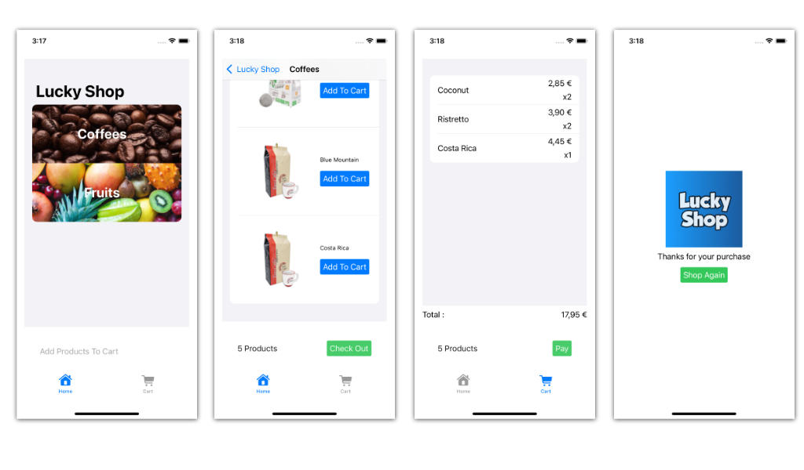

# <font color='#10409F'>Lucky Shop</font>

<b>Lucky Cart Client Sample Application Project</b>

A simple shopping application sample using a trivial structure ( Shop, Customer, Cart, Products and Orders ).

It demonstrates the LuckyCart integration steps that will enable promotional banners and games.

This is a SwiftUI based project, that runs on ios and macos platforms.



## <font color='#1E72AD'>Installation:</font>

### Swift Package:

 Add the <b>LuckyCart</b> Package using xCode

### CocoaPods:

 ```
 pod 'LuckyCart'
 ``` 
 
## <font color='#1E72AD'>Use in Client Application:</font>

### 1 - Start LuckyCart 

```
// 1 - Configure and start LuckyCart engine
    
let auth = LCAuthorization(key: <authKey>, secret: <secret>)
let luckyCartCustomer = LCCustomer(<id>)
let luckyCartCart = LCCart(<id>)
    
let luckyCart = LuckyCart(authorization: LCAuthorization, 
                          customer: LCCustomer, 
                          cart: LCCart,
                          ticketComposerClosure: {
                          
                              // Generates the ticket that will be sent to LuckyCart

                              // Fill the structures with your information here

                              let customer = LCTicketComposer.LCCustomer()
                              let order = LCTicketComposer.Order()
                              let cart = LCTicketComposer.Cart()

                              // Add any extra information here
                              let metaData = LCTicketComposer.MetaData()
                              
                              return LCTicketComposer(customer: customer, 
                                                              order: order, 
                                                              metaData: metaData, 
                                                              cart: cart)
                            })
                            

```

### 2 - Display Banners

### 3 - Display Games

### 4 - Play Games


©2022 Lucky Cart


